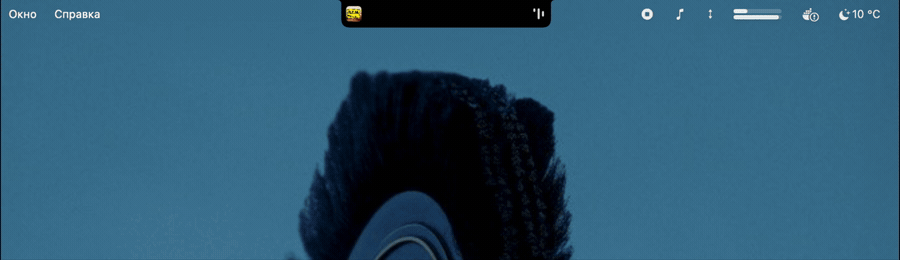

<h1 align="center">Notchturne</h1>

<p align="center">
  Apple Music прямо в чёлке MacBook — обложка, текст песни по строкам, управление, календарь и буфер обмена.
</p>

<p align="center"><i><a href="README.md">English version</a></i></p>



## Что это

Пока панель свёрнута, она живёт в строке меню по бокам от выреза: слева обложка, справа три полоски, которые дышат в такт. Наведи на полоски — станут кнопкой паузы.

Наведи на саму чёлку — из неё вырастет панель с тем, что ты включил:

| Секция | Что внутри |
|---|---|
| **Плеер** | обложка, название, исполнитель, ползунок с перемоткой, кнопки, сердце с настоящим состоянием «Избранного» из Music и меню добавления трека в твои плейлисты |
| **Текст песни** | построчно, едет за песней и подсвечивает текущую строку — в любой момент можно листать самому |
| **Календарь** | текущий месяц, сегодняшнее число обведено, под занятыми днями точка |
| **Буфер обмена** | последнее скопированное, клик возвращает запись обратно в буфер |

Шестерёнка в правом верхнем углу открывает настройки прямо внутри панели: какие секции показывать, сколько записей держать в буфере, язык интерфейса. Иконку в строке меню можно спрятать — выход тогда живёт в тех же настройках.

## Требования

macOS 14 Sonoma или новее, MacBook с чёлкой, Apple Music.

## Установка

**Вариант 1 — готовый билд (проще всего):**

1. Скачай `Notchturne.zip` со страницы [Releases](../../releases/latest)
2. Разархивируй и перетащи `Notchturne.app` в `/Applications`
3. Запусти **правым кликом → Открыть** (а не двойным кликом) — приложение не подписано Apple Developer сертификатом, поэтому при первом запуске macOS покажет предупреждение «не удалось проверить разработчика». Правый клик → Открыть → подтвердить — дальше запускается как обычно

**Вариант 2 — собрать из исходников** (нужен только Xcode Command Line Tools, полноценный Xcode не требуется):

```bash
git clone https://github.com/violoctecia/Notchturne.git
cd Notchturne
./build.sh
cp -R build/Notchturne.app /Applications/
open /Applications/Notchturne.app
```

<details>
<summary>Почему macOS переспрашивает доступ после обновления</summary>

Система узнаёт приложение по отпечатку его содержимого, а он меняется с каждой сборкой. Поэтому после установки новой версии доступ к Музыке придётся выдать заново — один раз на версию.

Если собираешь сам и часто, сделай себе сертификат: **Связка ключей → Ассистент сертификации → Создать сертификат**, имя `Notchturne Dev`, самоподписанный корневой, тип **«Подпись кода»**. `build.sh` подхватит его сам и напишет, чем подписался — отпечаток станет постоянным.
</details>

## Разрешения

Одно, и оно видно в системных настройках: **Автоматизация → Music**. Доступ к календарю спрашивается, только если включить календарь, и никогда иначе.

Больше ничего — ни «Универсального доступа», ни записи экрана, ни мониторинга ввода. Наведение определяется опросом положения курсора, а не перехватом событий, именно чтобы не просить лишних прав.

## Откуда берутся данные

Воспроизведение и обложки — из самой Music через AppleScript, без приватных API. В сеть ходят две функции, обе выключаются в настройках; с выключенными приложение не создаёт соединений вообще:

| Функция | Куда | Что отправляет |
|---|---|---|
| Текст песни | `lrclib.net` | исполнитель, название, альбом, длительность |
| Запасной поиск обложки | `itunes.apple.com` | исполнитель, альбом |

Свои тексты Apple третьим сторонам не отдаёт, поэтому [LRCLIB](https://lrclib.net) — открытая база, которую наполняет сообщество, — единственный доступный источник. За пределами англоязычного мейнстрима покрытие неровное.

История буфера живёт только в памяти и пропадает при выходе, на диск не пишется ничего. Записи, помеченные приложениями как конфиденциальные, пропускаются — так себя метят менеджеры паролей.

## Ограничения

- **Пока только Apple Music** — см. раздел «Дальше».
- Каталожный трек, которого нет в медиатеке, при добавлении в плейлист сначала сохраняется в медиатеку — иначе Music отказывается его куда-либо класть. Занимает несколько секунд, на кнопке крутится индикатор.
- Текст без тайм-кода показывается, но ничего не подсвечивается: выдавать догадку за точное попадание нечестно, поэтому такой текст листается вручную.

## Дальше

Сейчас Notchturne умеет работать только с Apple Music. Следующими появятся **Яндекс Музыка**, **Spotify** и воспроизведение **в браузере** — источник будет выбираться там же, в настройках.

## Лицензия

MIT
